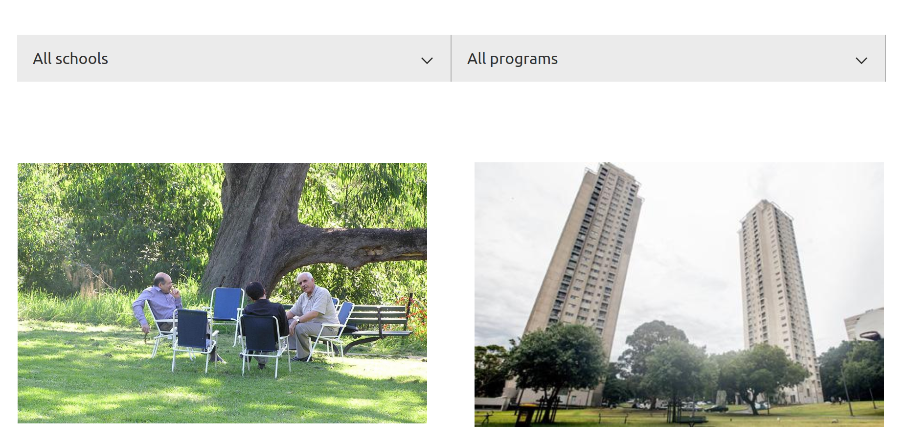

## Next level Search API
#### Tips for custom search in Drupal

---

### ℹ️ Who am I?

<ul>
<li>I'm Saul</li>
<li class="fragment fade-in">Drupal developer at PreviousNext</li>
</ul>

Notes:
- I'm Saul
- ➡️ I'm a Drupal Developer at PreviousNext

---

### 🪟 View from my office

Notes:
- I live in the Northern Rivers of NSW with my wife and young kids
- We're building our own house
- We live off grid, spring fed damn for water, solar + batteries for power, composing toilet, Starlink for internet
- All possible thanks to PNX's distributed team
- Side note - We're hiring! Come work with inspiring teammates

---

### ℹ️ Overview

<ul>
<li class="fragment fade-in">Great SaaS search solutions exist</li>
<li class="fragment fade-in">Sometimes roll your own solves your exact problem</li>
</ul>

Notes:
- What are we going to talk about today?
- ➡️ Software as a Service or SaaS offer many great out of the box features for search
- Examples include Sajari/Algolia, Google Programmable Search Engine, Swiftype
- However these can be costly, might hit feature limits
- ➡️ Implementing your own search can overcome these
- Today we'll cover: brief into to search in Drupal
- Dive into Drupal Search API. I'm going to assumes you're familiar with Search API (SAPI)
- We'll cover 4 lesser know areas of SAPI

---

### 🔍 Search in Drupal

<ul>
<li class="fragment fade-in">Search is as <a href="https://git.drupalcode.org/project/drupal/-/blob/3.0.x/modules/search.module">old as Drupal</a></li>
<li class="fragment fade-in">Search API module offers a framework to extend search</li>
</ul>

Note:
- ➡️ Search has been around since Drupal 3 (or before), 21 years ago!
- Fine for small site, but hasn't evolved much
- Relatively limited functionality
- ➡️ Search API offers a framework for extending search and allows searching all entities in Drupal
- Filtering, faceting
- Supports multiple backends; Apache Solr, Elasticsearch, OpenSearch, Lunr and many others
- Going to dive into features for a few different backends
- Which brings us to

---

### ☀️ Apache Solr

<ul>
<li class="fragment fade-in"><a href="https://solr.apache.org/">solr.apache.org</a></li>
<li class="fragment fade-in">Excellent <a href="https://www.drupal.org/project/search_api_solr">Search API support</a></li>
</ul>

Notes:
- Apache Solr
- ➡️ Solr is an open source project, managed by the Apache Foundation
- SaaS platforms for hosting Solr exist
- We'll be focusing on host your own Solr
- ➡️ Solr has excellent integration into SAPI, it's probably the most supported SAPI backend
- Going to dive into 2 lesser know features of Solr:

---

### ☀️ 1. Searching multiple sources

<ul>
<li class="fragment fade-in">Indexing multiple sources</li>
<li class="fragment fade-in">Results shown in one interface</li>
</ul>

Notes:
- ➡️ Solr can index data to be searched from multiple sources
- For example, multiple sub sites could send data to a single index
- These sites can even been on different platforms, e.g. legacy Drupal 7, or Wordpress
- ➡️ Results can then be searched seamlessly from one search interface, such as from the main or parent site

---

### ☀️ Solr server config

Notes:
- ➡️ This is the SAPI configuration for this
- You'll see there's 2 Solr servers. The first is for the main site content with an index of normal Drupal 10 content
- The second is a Drupal 7 specific Solr server
- External Drupal 7 sites will send their indexed content, in Solr document format, to this server

---

### ☀️ Pushing content into the index

<pre class="php fragment fade-in">
<code>
/** Implements hook_search_api_solr_documents_alter(). */
...
/** @var \SearchApiSolrDocument $document */
foreach ($documents as &$document) {
  $rendered_item = theme('mysearch_rendered_item', [
    'title' => check_plain($node->title),
    'text' => token_replace('[node:summary]', ['node' => $node],
    'uri' => url('node/' . $node->nid, ['absolute' => TRUE]),
    ...
  ]);
  $document->addField('tm_en_rendered_item', $rendered_item);
}
</code>
</pre>

Notes:
- Pushing content into the index
- ➡️ Drupal 7 site then needs to implement hook_search_api_solr_documents_alter
- Simply loops over each document to be indexed (i.e. a Drupal 7 node)
- Builds a rendered item using the node title and summary, and an absolute URL to link to the full content
- Output is themed, but it's important to not that it is just html, which Solr can consume and add into its document index
- Finally, we call addField() on the document to add the rendered item
- Additional fields, e.g. title or taxonomy, can be added as needed
- This is obviously Drupal 7 code, there are corresponding Event Subscribers for Drupal 8+
- Other platforms like Wordpress could build the Solr Document and send it to the indexed as needed

---

### ☀️ Displaying search results

Notes:
- Now we're ready to display the search results
- All indexed fields are available for processing as normal, for example applying a boost to a title fields
- ➡️ Important option on the server is to enable Solr to send full search results
- This allows our indexed Solr documents to be returned
- ➡️ Fields are then available for Full text search in views
- For example here we've configured views to search Title and Body from Drupal 10 content, as well as the Rendered item and Taxonomy title Ngram fields from Drupal 7
- End result is a single search interface which seamlessly shows results from multiple sites

---

### ☀️ 2. Solr facets

<ul>
<li class="fragment fade-in">Facets are a standard search feature</li>
<li class="fragment fade-in">However, <a href="https://opensourceconnections.com/blog/2013/02/11/convenient-solr-feature-facet-over-the-same-field-multiple-times-with-different-filters/">Solr can facet</a> over the <a href="https://solr.apache.org/guide/7_0/faceting.html#tagging-and-excluding-filters">same field more than once, in a single query!</a></li>
</ul>

Notes:
- Next up are facets
- ➡️ Facets allow users to narrow results by applying filters
- Think of checkboxes in the left column on Amazon.com
- These filters often map to taxonomy terms in Drupal
- Facets are well supported in SAPI via the Facets module
- However, we had an interesting feature request from a client
- When facets were active they shouldn't limit the list of other facets
- All facets should display at all times
- ➡️ We found a lesser know Solr feature to do this, in a single query!
- The concept is a bit tricky, so is best illustrated with an example

---

### ☀️ Faceting requirements

Notes:
- Here are the facet requirements
- A list of content, display as images in this case
- Two filters, or facets on Schools and Programs

---

### ☀️ Facets

Notes:
- Sample values like School 1, School 2, Program 1, Program 2, etc

---

### ☀️ Facets (with item count)

Notes:
- Each facet then displays the count of items
- For example there are 6 pieces of content tagged with School 1
- Up to this point it is all standard facet features

---

### ☀️ Facets (with active facet)

Empty facets (zero results) don't disappear!

Notes:
- The difference comes when a facet is clicked
- Here, Program 2 has been clicked
- ➡️ Facets with zero results **still show**
- In normal facetting these results would not be show at all, as they're not part of the query results
- In this case School 1 and 3 would not be in the list at all
- Instead here, inactive facets, or ones with zero results, are greyed out
- Keeping them in the results set alerts users to the full set of available facets
- This was the client requirement, they want users to know about School 1, 2 and 3 even if they've drilled down into the facets
- The client had 3 facets and a dozen or so terms in each, so this approach might not work on a big dataset
- Again, the goal here is to surface all options, even when facets are applied
- Let's look at the implementation

---

### ☀️ Facets fields

Notes:
- When adding our fields to the SAPI index we add 2 taxonomy term fields for Program and School
- We'll alter these and exclude them, so they'll return results as if no facets were applied
- We then add a second fake "filtered" field for each term
- For these we'll tell Solr to run the regular facetting on them

---

### ☀️ Solr query pseudocode

<pre class="js fragment fade-in">
<code>
...
fq={!tag=program_facet}filtered_field_program:123&
facet.field={!ex=program_facet}field_program
...
</code>
</pre>

Notes:
- Let's look at what we're trying to achieve in the Solr query
- ➡️ If you've never seen a Solr query this will be complete gibberish
- Basically we want to tag the filtered program field. Here that's being filtered on a taxonomy term with an id of 123
- Then marked it as excluded when the unfiltered version runs
- So, how do we do this in Drupal?

---

### ☀️ Implementing facets in SAPI

<pre class="php fragment fade-in">
<code>
/** Implements hook_search_api_solr_query_alter(). */
...
// 1. Mark original facet as excluded.
$facetSet = $solariumQuery->getComponent('facetset');
$excludes = ['facet:field_school', 'facet:field_program'];
$facetSet->getFacet('itm_field_school')->getLocalParameters()->setExcludes($excludes);
$facetSet->getFacet('itm_field_program')->getLocalParameters()->setExcludes($excludes);
...
</code>
</pre>

Notes:
- ➡️ In our custom code we implement hook_search_api_solr_query_alter
- We need to do 3 things to wire this all up
- First we mark the original facets as excluded, i.e. we don't want to filter on these
- We want these always be present, like there is no filtering applied

---

### ☀️ Implementing facets in SAPI

<pre class="php">
<code>
...
// 2. Add a second set of "fake" facets without excludes.
$facetSet->createFacetField('itm_filtered_field_school')->setField('itm_filtered_field_school');
$facetSet->createFacetField('itm_filtered_field_program')->setField('itm_filtered_field_program');
// 3. Match the options from a valid facet.
$facets['filtered_field_school'] = [
  'field' => 'filtered_field_school',
  'limit' => 0,
  'operator' => 'and',
];
$query->setOption('search_api_facets', $facets);
</code>
</pre>

Notes:
- Next we create a second set of fake facets without the excludes
- Finally, we set the fake facet options to match those of a real facet
- Massive hat tip to my colleague Lee Rowlands who found that this was actually possible, and helped a lot in implementing it
- This is a bit of an edge case for a client requirement, but likely something that could not be implemented on SaaS search platform

---

### 🌜 3. Lunr

<ul>
<li class="fragment fade-in"><a href="https://lunrjs.com/">lunrjs.com</a></li>
<li class="fragment fade-in"><a href="https://www.drupal.org/project/search_api_lunr">Search API Lunr</a> module</li>
</ul>

Notes:
- Next up we have Lunr
- ➡️ Original slogan: Like Solr but not as bright
- New slogan: Search made simple
- Both are a good summary of what Lunr offer
- Written entirely in JS
- Search run client side, or on the server with Node.js
- ➡️ Drupal implementation extends Search API
- It was written by former PNX colleague Sam Becker, and I have a soft spot for it as I maintain it now

---

### 🌜 Instant search

<ul>
<li class="fragment fade-in">Instant results as the user types</li>
<li class="fragment fade-in">Works for autocomplete and full page search results</li>
</ul>

Notes:
- ➡️ The Drupal implementation runs the search on the client side
- When you begin to type, suggestions for matching pages appear immediately
- ➡️ Can be implemented as an autocomplete to show results as you type
- And/or as a normal search page where a query is submitted and teaser results displayed

---

### 🌜 Lunr in Drupal

Notes:
- ➡️ The backend is configured like any other SAPI search provider
- Allows configuration of searched entities and bundles
- Configure fields, boosting and processing pipelines applied to each field
- The difference is the SAPI indexing process creates a collection of documents
- These documents are sent as bundles of json to the client where their browser builds the index
- As a result there's no Node.js dependency on the server
- This means no build process so things like regular or even automated scheduled content changes are indexed with no latency

---

### 🌜 Fuzzy and partial matching

Notes:
- ➡️ Fuzzy search and partial matching are supported
- This effectively gives you an ngram like matching system supporting matching on misspellings and on word fragments
- In practice this matching it is not as configurable as Solr, but gets you 80% of the way there with no setup required

---

### 🌜 Considerations

<ul>
<li class="fragment fade-in">Search index only loads as needed</li>
<li class="fragment fade-in">Works well for small to medium indexes</li>
<li class="fragment fade-in">Provides an API to allow searching outside Drupal</li>
</ul>

Notes:
- There are some important considerations when using Lunr
- ➡️ No cost is incurred for any sessions that don't actually make use of search
- For optimisation a light index of document titles can be built for the autocomplete, with a separate larger index only used once a search form is actually submitted
- ➡️ There are some practical limits of requiring the client browser to build the index
- It performs well for hundreds or up to a few thousand documents, however it isn't a good fit for large search indexes
- ➡️ There's also a corresponding JavaScript API to allow the frontend to query the index with no reliance on the Druapl backend

---

### 📖 4. OpenSearch

<ul>
<li class="fragment fade-in"><a href="https://opensearch.org/">opensearch.org</a></li>
<li class="fragment fade-in">Open source Apache 2.0 license</li>
</ul>

Notes:
- ➡️ And finally we have OpenSearch
- This is an open source software suite for search
- It is a fork of Elasticsearch and Kibana created in 2021 by Amazon
- Two side to every fork, but essentially AWS opted to go its own way and create OpenSearch
- If you're familiar with Elastic then it largely maps to OpenSearch
- ➡️ The project is under the Apache 2.0 license, which bodes well for the maintainership of the project into the future

---

### 📖 OpenSearch in Drupal

<ul>
<li class="fragment fade-in"><a href="https://www.drupal.org/project/search_api_opensearch">Search API OpenSearch</a> module</li>
<li class="fragment fade-in">Supports multiple backend providers</li>
</ul>

Notes:
- ➡️ The Search API OpenSearch module is maintained by my colleague and boss Kim Pepper
- You guessed it, it's a fork of the Elasticsearch connector module 
- Has all the regular integration for indexing, field mapping, views etc.
- It supports facets, More Like This, boosting, synonyms
- Recently added search_as_you_type field, which  provides a simple way to set up autocomplete, no need to configure ngrams and the like
- Though there is also full support for ngrams and edge ngrams
- ➡️ Out of the box is supports basic auth to connect to the backend
- It provides a Connector plugin type for customising backend authentication
- This means you can roll your own backend, or connect to a hosted service

---

### 📖 Hosted OpenSearch

<ul>
<li class="fragment fade-in"><a href="https://aws.amazon.com/opensearch-service/">Amazon OpenSearch Service</a></li>
</ul>

Notes:
- ➡️ A hosted service like Amazon OpenSearch Service 
- It offers an alternative backend and provides hands off managed search provided by AWS
- AWS maintain the OpenSource stack and manage version updates
- It offer services like scaling, replication, Role Based Access Control, and data visualisation
- You'll notice we've come full circle here with a hosted search solution!
- The reality is sometimes SaaS is a good fit

---

### 📋️ Summary

<a href="https://fenstrat.github.io/next-level-searchapi-ds-wellington">fenstrat.github.io/next-level-searchapi-ds-wellington</a>

Notes:
- These slides are available on Github if you like to refer to them
- Search is an important part of most Drupal sites.
- While SaaS solutions can be great, custom building your search stack can solve your exact needs
- Hopefully this session has shown you a few new tricks to add to your search tool belt

---

### Questions ❓️

🗨️ fenstrat drupal.org + Drupal Slack

